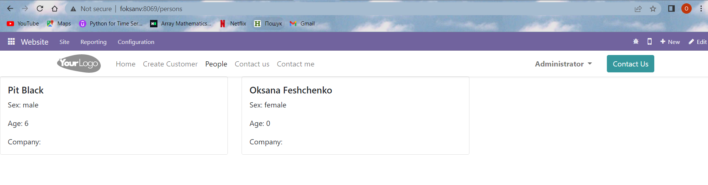
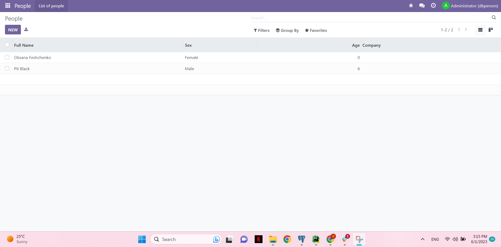
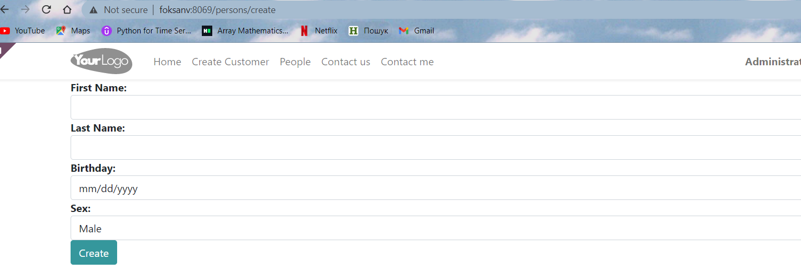

# Person Odoo Project

This is a custom Odoo project for managing person records.



## Features

- Create person records
- Display a list of all persons
- Search and filter persons based on various criteria


## Installation


1. Clone the repository to your local machine
```
git clone https://github.com/oksana-feshchenko/odoo16-people.git
```

2.  Create a new virtual environment
```
python3 -m venv env
```

3. Activate the virtual environment (Linux/Mac)
```
source env/bin/activate
```

4.  Activate the virtual environment (Windows)
```
env\Scripts\activate
```

5. Install the required dependencies
```
pip install -r requirements.txt
```

6. Configure the database connection
# - Create a new PostgreSQL database for the project
# - Update the `odoo.conf` file with the appropriate database credentials

7. Run the Odoo server

